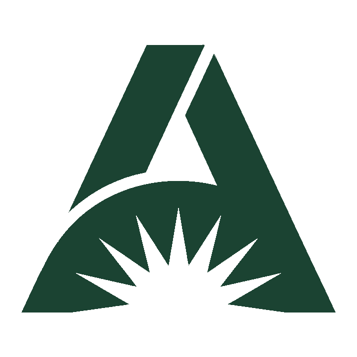

<div align="center">



# AI Sustained

**AI that survives Monday morning.**

Practical, evidence-led writing on AI adoption, capability, agentic workflows and sustainability.
By [Kevin Clubb](https://www.linkedin.com/in/kevinclubb), senior business analyst.

[**Read at ai-sustained.com →**](https://ai-sustained.com)

</div>

---

## About

This repository is the source for **[ai-sustained.com](https://ai-sustained.com)** — an article series written for people who actually use AI at work, not people being sold it.

Each issue covers one corner of the AI-at-work landscape: where the workforce sits on the capability curve, what practical AI adoption looks like, the cost of running frontier models, and the cultural shifts agentic AI is forcing through enterprise teams.

No hype. No "10 prompts to..." listicles. Just honest writing from inside the work.

---

## The issue series

| # | Title | Status |
|---|---|---|
| 000 | Death of the IT Dept | Live |
| 001 | The AI competency pyramid | Live |
| 002 | AI-curious? The bit no one tells you | Live |
| 003 | Four labs. Seven days. No clear winner. | Live |
| 004 | Vibe coding capability | Live |
| 005 | A British prompt | Live |
| 006 | Interactive dashboards in 3 mins | Coming soon |

New issues land roughly every 7–10 days. Follow [Kevin on LinkedIn](https://www.linkedin.com/in/kevinclubb) for new-issue notifications.

---

## How the site is built

Hand-written HTML and CSS in the **Clinical Green** design system. No frameworks, no build step, no JavaScript dependencies. The whole site is static files served directly.

### Stack

- **Source**: this GitHub repo
- **Hosting**: [Cloudflare Pages](https://pages.cloudflare.com) (free tier)
- **Domain**: registered through Cloudflare Registrar
- **SSL**: provisioned automatically by Cloudflare
- **CDN**: Cloudflare's global edge network
- **Build pipeline**: none — files in this repo are served as-is

Auto-deploy is wired up: every commit to `main` triggers a Cloudflare Pages rebuild within 60 seconds. No CI/CD, no manual deploy steps.

### Design system

The site uses a single design language called **Clinical Green**:

- **Base**: `#F7FCF9` (Mint Mist)
- **Accent**: `#1B4332` (Deep Moss)
- **Secondary**: `#40916C` (Sage)
- **Highlight**: `#D8F3DC` (Light Mint)

Typography:
- Display: Playfair Display italic (headlines, pull-quotes)
- Body: Plus Jakarta Sans (UI, deck copy)
- Data/labels: JetBrains Mono (kickers, metadata)

The signature patterns: italic Playfair headline with one accent word in sage · paginated mint stat-card grids · dark Deep Moss "Tactical Takeaway" panel as the closing beat of every article.

---

## Repo structure

```
ai-sustained/
├── index.html                          ← landing page
├── ai_sustained_logo.png               ← master logo file
├── ai_sustained_logo_mark.png          ← logo mark (transparent bg)
├── ai_sustained_wordmark.png           ← wordmark with tagline
├── favicon.ico                         ← multi-resolution Windows icon
├── favicon-16.png                      ← browser tab (low DPI)
├── favicon-32.png                      ← browser tab (retina)
├── favicon-48.png                      ← Google Search Results
├── favicon-180.png                     ← Apple touch icon (iOS home screen)
├── favicon-192.png                     ← Android PWA
├── favicon-512.png                     ← Open Graph / link previews
├── robots.txt                          ← crawler instructions
├── sitemap.xml                         ← search engine sitemap
└── articles/
    ├── ai-competency-pyramid/
    │   ├── index.html
    │   └── cover.png
    ├── ai-curious/
    │   ├── index.html
    │   └── cover.png
    └── <new articles go here>/
```

---

## Adding a new article

For future-me reading this:

1. **Create the folder** in GitHub web UI: `Add file → Create new file → articles/<slug>/index.html`
2. **Paste the article HTML** (generated via the `ai-sustained-newsletter` Claude skill)
3. **Upload the cover image** as `cover.png` into the same folder
4. **Update `index.html`** to add a new article card in the grid:
   ```html
   <a class="card" data-topic="<topic>" href="/articles/<slug>/">
     <div class="card-image">
       /cover.png" alt="..." />
     </div>
     <div class="card-body">
       <div class="card-meta">
         <span>Issue 00X</span><span class="dot"></span>
         <span>Topic</span><span class="dot"></span>
         <span class="muted">X min read · DD MMM YYYY</span>
       </div>
       <h3 class="card-title">Article title here.</h3>
       <p class="card-deck">Deck copy here.</p>
       <span class="card-cta">Read</span>
     </div>
   </a>
   ```
5. **Update `sitemap.xml`** to add the new URL
6. **Commit** — Cloudflare auto-deploys within 60 seconds
7. **Request indexing** in Google Search Console (URL Inspection tool → Request Indexing)

---

## Brand assets

| File | Use |
|---|---|
| `ai_sustained_logo.png` | Master logo file — high-res, transparent background |
| `ai_sustained_logo_mark.png` | Triangular mark only — use anywhere the brand needs identification |
| `ai_sustained_wordmark.png` | Text mark "AI SUSTAINED" + tagline |
| `favicon-*.png` | Various favicon sizes for browser tabs, Google, iOS, Android |

The mark is a triangular **A** with sunrise rays — the pyramid alludes to the AI capability hierarchy (Issue 001), and the sunrise alludes to sustained, sustainable adoption. The Deep Moss colour palette echoes the "Clinical Green" design system used throughout.

---

## Licence & re-use

- **Article content** — © Kevin Clubb 2026. All rights reserved. Don't republish full articles without permission. Short quotes with attribution are welcome.
- **Design system** — feel free to take inspiration. Don't clone wholesale.
- **Code** — the HTML/CSS is straightforward enough to learn from. Use it as a reference, build your own.

---

## Connect

- **Site** — [ai-sustained.com](https://ai-sustained.com)
- **LinkedIn** — [linkedin.com/in/kevin-clubb](https://www.linkedin.com/in/kevin-clubb)
- **Email** — kevinclubb@duck.com

If something here is useful, share it. If something is wrong, tell me. If you want to talk shop, find me on LinkedIn.
